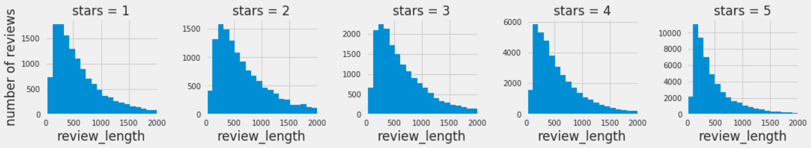
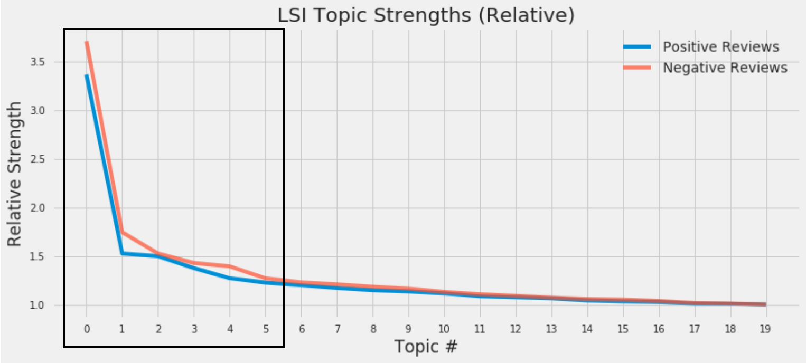
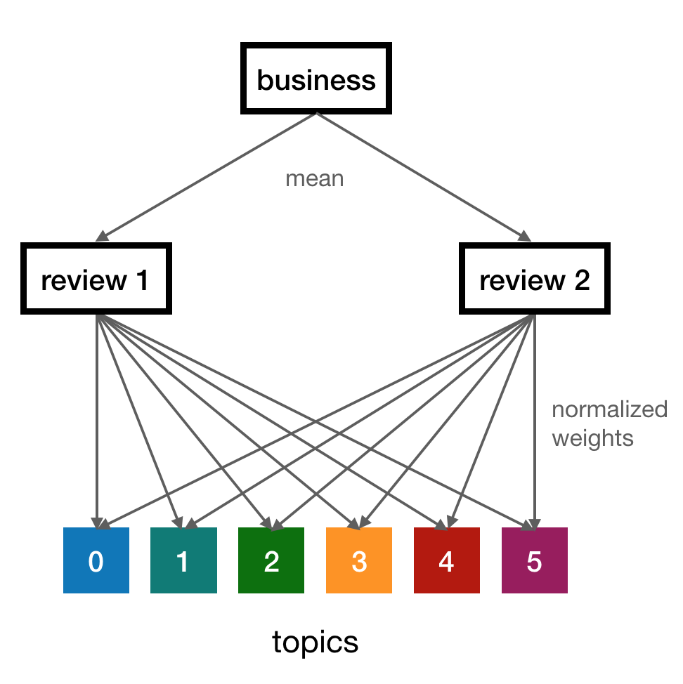
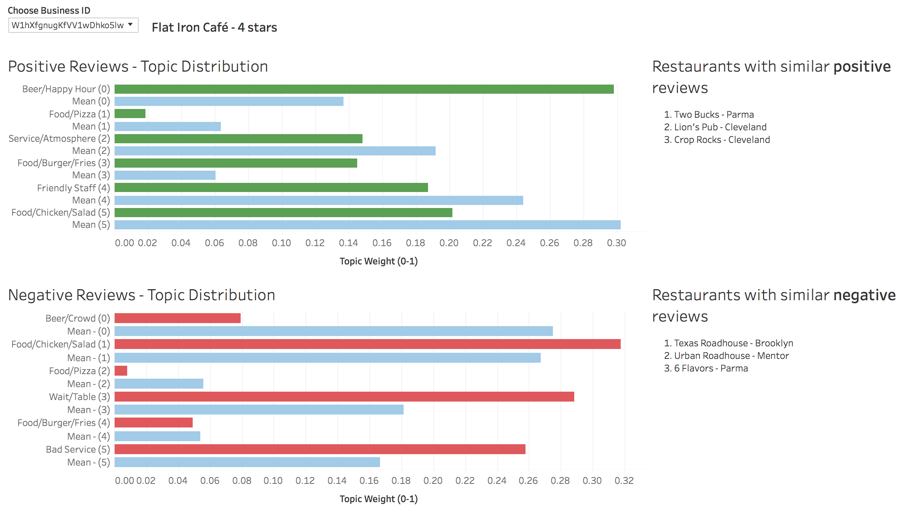

# NLP Analysis of Yelp Restaurant Reviews  

Ankur Vishwakarma  

Metis SF Winter 2018  

---

**Project Abstract:** 

Opening and managing a restaurant in the United States is a difficult business. According to Business Insider, as many as [60% of restaurants close within the 1st year of opening](www.businessinsider.com/why-restaurants-fail-so-often-2014-2). Yelp is a great source of positive and negative feedback from customers. However, it can be time consuming to read all reviews and that still would not allow a restaurant owner to compare feedback against other restaurants in the area.

This project aims to analyze restaurant reviews on Yelp via topic modeling to determine main topics for positive and negative reviews. Once each review can be assigned its topic weights, that information was averaged to assign topic weights for each restaurant. 

With all restaurants and their reviews translated into a topic space, direct comparison of positive and negative review topics was made possible.

---

### Data Source

1. Data in JSON format was downloaded from [Yelp](https://www.yelp.com/dataset) and set up in MongoDB on an AWS instance.

### Exploratory Data Analysis  

1. The 1st notebook (1_extracting_reviews.ipynb) reads the data from MongoDB.

2. Of the 5.2 million reviews it contains, 130,000 restaurant reviews for the state of Ohio were kept for analysis. 

3. Lengths of the reviews were calculated and as the histogram below shows, all star ratings consisted of the same distribution of short, long, and medium-length reviews. 

   

### Tokenization  

* Code in the 2nd notebook (2_text_processing.ipynb).

Documents (yelp reviews) were tokenized using TFIDF and 1-grams, which gave the most consistent results and distinct topics. For topic modeling, the following approaches were used:

|         | **Notes**                                |
| ------- | ---------------------------------------- |
| **LSI** | Negative word weights in resulting topics were not easily interpretable for this application. Topic strengths from LSI were used to determine # of topics. |
| **LDA** | Topics had lots of overlap in meaning among each other, which would be the result of relatively short document size. |
| **NMF** | Gave most interpretable results and separable topics. Rest of the analysis was done using NMF. |

There were 1 set of topics for positive reviews and 1 set of topics for negative reviews. The elbow plot below shows the relative strengths of the topics and that 6 topics were chosen for the analysis.

### Mapping All Reviews  

1. Map all reviews to topics using Non-negative Matrix Factorization (NMF).

2. Normalize topic weights to sum to 1.

3. Average topic distributions for all reviews of a restaurant to map that restaurant to the topic space (shown below). 

   

4. Save information to CSV files.

5. Visualize data using Tableau.

### Visualizing The Results  

The data can be used to show topic strengths for positive & negative reviews and how they compare against other restaurants in Ohio.  

The interactive visualization on Tableau public can be reached at [this link](https://public.tableau.com/profile/ankur.vishwakarma#!/vizhome/Yelp_Dashboard/Dashboard1?publish=yes). The screenshot below shows what the dashboard looks like for a random restaurant from this analysis. 

